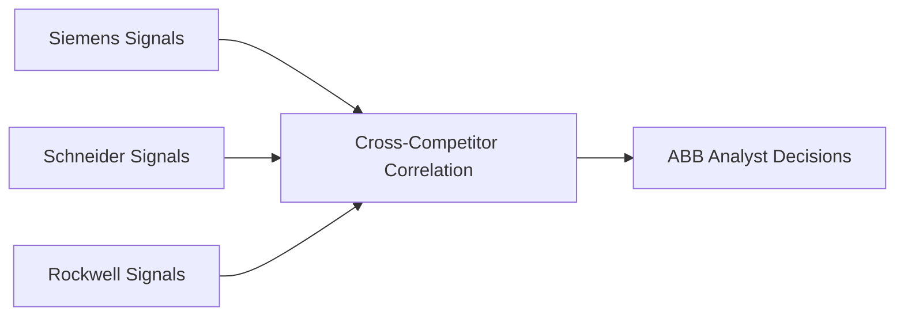
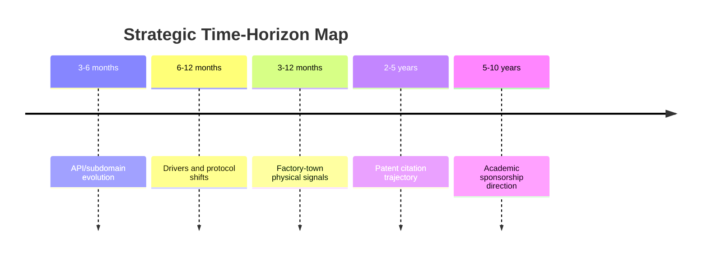
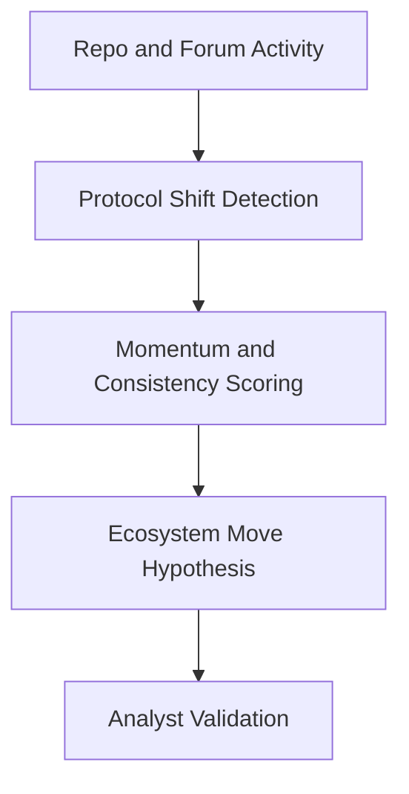
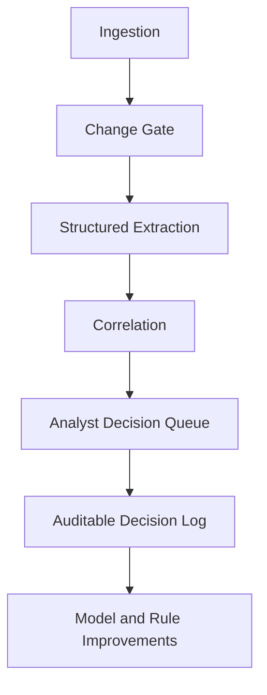
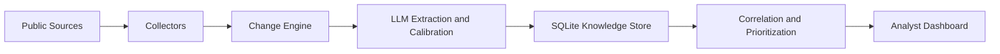

# RivalSense - Autonomous Competitor Early-Warning Intelligence

## ABB Strategic Perspective

| Item | Message |
| --- | --- |
| Mission | Detect competitor strategic maneuvers earlier by mining weak public signals before formal announcements. |
| Core target | Siemens Digital Industries, benchmarked against Schneider Electric and Rockwell Automation. |
| Strategic promise | Move from reactive tracking to proactive, evidence-based decision lead time. |
| Operating model | Autonomous, agentic pipeline that extracts, calibrates, correlates, and routes findings for analyst action. |

```text
Intelligence Maturity Curve

Reactive                                      Proactive
Press Releases -> Market Commentary -> Weak Signal Correlation (RivalSense)
```

---

# The Challenge and the Multi-Competitor Lens

## Why Traditional Monitoring Underperforms

- Critical competitor moves surface too late when teams depend on formal PR cycles.
- Manual monitoring creates analyst fatigue from repetitive source scanning and low-signal noise.
- Isolated company tracking can misclassify market-wide shifts as unique competitive threats.

## Comparative Monitoring Strategy (Big 3)

| Lens | Typical Interpretation Quality | Decision Risk |
| --- | --- | --- |
| Siemens only | Medium | Higher risk of false strategic urgency |
| Siemens + Schneider + Rockwell | High | Better separation of trend vs. unique move |



---


# Five Strategic Weak-Signal Families

Signals are selected to cover short-, medium-, and long-horizon strategic motion.

| Signal Family | Horizon | Representative Sources | Executive Relevance |
| --- | --- | --- | --- |
| Developer API and Subdomain Evolution | 3-6 months | Developer portals, API catalogs, CT logs | Early product/platform positioning clues |
| Niche Driver and Protocol Updates | 6-12 months | GitHub repos, industrial protocol forums | Engineering momentum before launch narratives |
| Hyper-Local Factory-Town Intelligence | 3-12 months | Zoning, permits, local newspapers | Physical capacity and operational intent |
| Outer-Industry Patent Citations | 2-5 years | Patent databases and citation graphs | Adjacent capability bets and convergence |
| Academic Sponsorship Trajectory | 5-10 years | University partnerships, grants | Long-term talent and capability shaping |



---

# Deep Dive: Developer API and Subdomain Evolution

| Dimension | Detail |
| --- | --- |
| Horizon | 3 to 6 months ahead |
| Source cluster | Developer portals, API catalogs, CT logs |
| Detection logic | Track new SDK references, auth model changes, endpoint launches, and deprecation trajectories |
| Strategic interpretation | Indicates partner ecosystem expansion, platform hardening, or integration push before formal launch messaging |
| ABB impact | Enables earlier partner strategy adjustments and migration planning windows |

```text
Illustrative Funnel

Raw surface deltas -> Relevant API events -> Cross-source corroboration -> Analyst action queue
      100%                  ~30-40%                  ~10-15%                  prioritized set
```

---

# Deep Dive: Niche Driver and Protocol Updates

| Dimension | Detail |
| --- | --- |
| Horizon | 6 to 12 months ahead |
| Source cluster | GitHub repositories, protocol forums, maintainer discussions |
| Detection logic | Observe commit velocity, adapter changes, protocol-specific issue patterns, and maintainer alignment |
| Strategic interpretation | Captures bottom-up ecosystem migration signals (for example, protocol standard consolidation) |
| ABB impact | Better timing for integration backlog shifts, partner outreach, and interoperability planning |



---

# Deep Dive: Hyper-Local Factory-Town Intelligence

| Dimension | Detail |
| --- | --- |
| Horizon | 3 to 12 months ahead |
| Source cluster | Municipal permits, zoning agendas, local German reporting, regional logistics notices |
| Detection logic | Extract facility expansion references, zoning amendments, equipment permits, and site-level logistics signals |
| Strategic interpretation | Reveals capacity and operational readiness before national-level communications |
| ABB impact | Provides earlier regional response planning for sales coverage and supply-chain readiness |

```text
Lead-Time Sequence

Local permit/zoning signal -> Site preparation and staffing -> National media / formal announcement
         early                     mid-stage evidence                     late confirmation
```

---

# Quality, Governance, and Risk Control

RivalSense is designed to be auditable, controllable, and decision-support oriented.

| Governance Pillar | Implementation Mechanism | Business Assurance |
| --- | --- | --- |
| Human-in-the-loop control | Analysts own Confirm/Dismiss/Escalate decisions | Final judgment remains with ABB teams |
| Change-first processing | Unchanged pages auto-filtered before extraction | Reduces noise and analyst overload |
| Constrained agent behavior | Scoped tasks and bounded execution policies | Limits hallucination and process drift |
| Responsible observability | Logging with automatic redaction and minimum exposure design | Supports compliance and trust |



---

# Architecture and Tech Stack

The V3 prototype uses a modular stack optimized for speed of iteration and operational clarity.

| Layer | Technologies | Purpose |
| --- | --- | --- |
| Orchestration | Python 3, LangChain | Agent sequencing, tool integration, workflow control |
| Intelligence | Google Gemini (`gemini-2.5-flash`) | Multi-event extraction and confidence calibration |
| Change engine | SHA-256 hashing, `difflib` | Delta detection and suppression of unchanged content |
| Persistence | SQLite (WAL mode) | Event store, snapshots, heuristics, and review history |
| Ops and delivery | Streamlit, APScheduler, Docker | Analyst UI, scheduled runs, and reproducible deployment |



---

# Current Status and Forward Roadmap

## Current State (V3 Prototype)

| Capability Area | Current State |
| --- | --- |
| End-to-end monitoring loop | Operational |
| Analyst review workflow | Operational |
| Cross-signal correlation | Operational |
| Monitoring and observability | Operational |
| Most mature signal track | Developer/API intelligence |

## Signal Inventory (Used vs Not Yet Live)

| Signal (`signal_type`) | Status | Where It Comes From |
| --- | --- | --- |
| `developer_api` | Used (live) | Current config + dedicated prompt support |
| `github` | Used (live) | Current config + prompt coverage |
| `open_source` | Used (live) | Source category covered in current pipeline |
| `corporate` | Used (live) | Source category covered in current pipeline |
| `careers` | Used (live) | Source category covered in current pipeline |
| `press` | Not used as primary track | Documented in prompt coverage; not in current top-priority live set |
| `events` | Not used as primary track | Documented in prompt coverage; roadmap candidate |
| `academic_sponsorship` | Not yet live | Documented in workflows and prompts; not wired to live URL targets |
| `patent_outer_citation` | Not yet live | Documented in workflows and prompts; not wired to live URL targets |
| `hyperlocal_zoning` | Not yet live | Documented in workflows and prompts; not wired to live URL targets |

```text
Signal Activation Snapshot (10 total)

Used now:      [#####.....] 5/10
Not yet live:  [#####.....] 5/10
```

## Next Milestones

| Roadmap Focus | Target Outcome |
| --- | --- |
| Expand live coverage for academic, patent, and hyper-local channels | Broader strategic visibility across horizons |
| Deepen multi-step agentic investigations | Better autonomous hypothesis formation and validation |
| Increase source automation breadth | Higher coverage with lower manual effort |

```text
Execution Path

Stable V3 core -> Wider source coverage -> Deeper investigation agents -> Scaled intelligence operations
```
