# RivalSense: Interview Overview (Solution and Methods)

## Project Summary

RivalSense is a competitor early-warning solution built to help ABB teams see meaningful market shifts earlier. It monitors public signals from Siemens, Schneider Electric, and Rockwell Automation, then turns those signals into structured, reviewable insights for faster business decisions.

## Problem Framing for Interviewers

### Baseline Challenge

- Competitor moves often become visible too late if teams rely only on formal announcements.
- Manual monitoring is repetitive and noisy.
- Important weak signals are spread across different public sources and time horizons.

### Why Weak Signals Matter

Weak signals are often the first signs of future product, ecosystem, hiring, and expansion direction. Capturing these early improves planning lead time and reduces reactive decision-making.

### Decision Windows Supported

- **3 to 6 months:** short-term platform and partner shifts (for product roadmap and market messaging).
- **6 to 12 months:** ecosystem and protocol movement (for portfolio positioning).
- **2 to 5 years:** cross-industry innovation direction (for strategic bets).
- **5 to 10 years:** talent and research trajectory (for long-horizon capability planning).

## Solution Design (High-Level Method)

RivalSense uses a phased approach from target definition to business action. The design goal is to minimize noise, improve confidence, and keep humans in control of escalation.

```mermaid
flowchart LR
  defineTargets[DefineTargets] --> collectSignals[CollectSignals]
  collectSignals --> detectMeaningfulChange[DetectMeaningfulChange]
  detectMeaningfulChange --> extractInsights[ExtractInsights]
  extractInsights --> calibrateConfidence[CalibrateConfidence]
  calibrateConfidence --> correlateSignals[CorrelateSignals]
  correlateSignals --> analystReview[AnalystReview]
  analystReview --> decisionShare[DecisionShare]
  decisionShare --> improveLoop[ImproveLoop]
```

### End-to-End Workflow

1. **Define targets** by competitor, source type, and strategic priority.
2. **Collect signals** on a recurring schedule from selected public sources.
3. **Detect meaningful change** so unchanged pages do not consume analyst attention.
4. **Extract insights** from new evidence and convert them into structured findings.
5. **Calibrate confidence** to reduce overconfident claims.
6. **Correlate signals** across competitors and sources to detect broader themes.
7. **Review with analysts** for confirm, dismiss, or escalate decisions.
8. **Share decisions** with stakeholders and feed outcomes back into improvement.

## Methods and Design Choices (Why This Approach)

### Change-First Processing

Only changed content is processed deeply. This improves focus, reduces operational waste, and shortens time-to-insight.

### Confidence Calibration + Analyst Review

A confidence step plus human review balances speed with trust. This reduces false positives and keeps final escalation grounded in evidence.

### Cross-Signal Correlation

Individual events can be noisy. Correlation across multiple sources and competitors surfaces stronger strategic themes.

## Signal-by-Signal Method Summary

### 1) Niche Driver and Protocol Update Spikes

- **Strategic intent:** detect early platform and protocol bets.
- **Typical evidence:** repository activity, protocol discussions, public release changes.
- **Expected lead time:** 6 to 12 months.
- **Decision impact:** adjust integration priorities and ecosystem partnerships earlier.

### 2) Academic Sponsorship Trajectory

- **Strategic intent:** understand long-term capability and talent direction.
- **Typical evidence:** research lab sponsorship, fellowship patterns, academic collaboration signals.
- **Expected lead time:** 5 to 10 years.
- **Decision impact:** shape long-horizon talent and innovation partnerships.

### 3) Patent Citations from Outer Industries

- **Strategic intent:** identify cross-industry knowledge transfer before mainstream adoption.
- **Typical evidence:** patent references connecting automation with adjacent sectors.
- **Expected lead time:** 2 to 5 years.
- **Decision impact:** prioritize scouting and strategic option development.

### 4) Hyper-Local Factory Town Intelligence

- **Strategic intent:** capture early operational expansion intent.
- **Typical evidence:** local permitting, zoning, and regional development clues.
- **Expected lead time:** 3 to 12 months.
- **Decision impact:** prepare local market response and operational readiness.

### 5) Developer API and Subdomain Evolution

- **Strategic intent:** detect platform and partner direction shifts early.
- **Typical evidence:** developer portal changes, interface updates, public developer ecosystem movement.
- **Expected lead time:** 3 to 6 months.
- **Decision impact:** adapt partner strategy, migration planning, and competitive positioning.

## What Is Live Today vs Roadmap

### Live in Current Prototype

- End-to-end competitor monitoring loop is operational.
- Analyst review workflow is available for human decision control.
- Correlation, alerting, and operational monitoring are present.
- Developer/API-focused monitoring is currently the strongest and most validated path.

### Framework-Level or Roadmap

- Some signals are defined with clear workflow methods but are not yet fully wired as live source coverage in the current setup.
- Future depth includes richer multi-step investigation and broader source automation.

## Quality, Governance, and Risk Control

- **Human-in-the-loop:** analysts remain final decision-makers for escalation.
- **Confidence handling:** findings are reviewed for certainty before broad sharing.
- **Governance boundaries:** controlled execution and auditable decision flow reduce operational risk.
- **Responsible observability:** monitoring and logging are designed to reduce sensitive data exposure.

## Interview Talking Points

### 60-Second Version

RivalSense is an early-warning system for competitor strategy. It tracks weak public signals, processes only meaningful changes, converts those into structured insights, calibrates confidence, and keeps analysts in control of escalation. The value is faster and more reliable strategic awareness with less manual noise.

### 3-Minute Version

The solution starts with a practical business problem: competitor intelligence is often late and manually heavy. RivalSense addresses this through a phased method: define targets, collect signals, detect meaningful changes, extract insights, calibrate confidence, correlate events, and route to analyst review. This design prioritizes quality and trust, not just automation speed. It is already operational as a working prototype, with strongest maturity in developer/API monitoring and clear pathways to expand deeper source coverage for other strategic signals.

### Likely Interview Questions and Short Answers

- **How do you control false positives?**  
  We combine confidence calibration with mandatory analyst review before escalation.

- **Why process only changed content?**  
  It reduces noise and cost, and improves analyst focus on genuinely new information.

- **How do you avoid overclaiming maturity?**  
  We explicitly separate current live capabilities from roadmap-level extensions.

- **How do you scale this approach?**  
  Add broader source coverage, increase automation depth in collection/verification, and keep the same review and governance model.

- **Where is business value delivered fastest?**  
  In early detection of platform and developer ecosystem shifts that can inform near-term product and partner decisions.

## Closing

RivalSense moves competitor tracking from reactive reporting to proactive intelligence. The core method is designed for interview-grade clarity: measurable workflow, explicit quality controls, human oversight, and realistic maturity boundaries.
