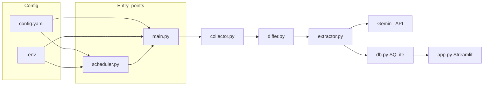

# Tech stack and runtime reference

This document describes what runs the RivalSense V2 prototype: language, processes, external services, configuration, and Python dependencies. For product behavior and quick start, see the [README](../README.md).

## Project type

- **Language:** Python 3 (single application; no Node.js frontend or `package.json` in this repo).
- **Deployment:** Local prototype only — no container orchestration, auth layer, or production hosting in the current tree.

## Runtime and processes

| Process | Command | Role |
|--------|---------|------|
| Pipeline | `python main.py` | Orchestrates collect → diff → extract → persist to SQLite (`main.py`). |
| Dashboard | `streamlit run app.py` | Streamlit’s built-in local web server for browsing events and charts (`app.py`). |
| Scheduler | `python scheduler.py` | APScheduler `BlockingScheduler`: runs the pipeline on startup, then every `schedule.interval_hours` from `config.yaml` (`scheduler.py`). |

There is **no** separate HTTP API server (for example FastAPI or Flask) in this repository.

## Architecture (data flow)

## LLM and external AI

| Item | Detail |
|------|--------|
| **Provider** | Google Gemini (Generative Language API). |
| **Client** | LangChain: `langchain-google-genai` → `ChatGoogleGenerativeAI` in `extractor.py`. |
| **Supporting packages** | `langchain` and `langchain-core` (prompt templates, `JsonOutputParser`) — `langchain-core` is installed as a dependency of the LangChain stack. |
| **Model ID** | Read from `config.yaml` under `llm.model` (default in repo: `gemini-2.5-flash`). Passed from `main.py` into `extract_events_from_text` together with `temperature` and `max_input_chars`. |
| **Secrets** | `GOOGLE_API_KEY` in the environment or `.env` (see `.env.example` and `config_loader.load_secrets`). |
| **Calls per extraction** | Up to **two** model invocations when events are returned: primary extraction, then a confidence calibration pass (`extractor.py`). |

## Data and storage

| Layer | Technology |
|-------|------------|
| **Database** | SQLite via the Python standard library `sqlite3` (`db.py`). |
| **Domain models** | Pydantic v2 models in `schema.py` (events, snapshots, failures, etc.). |
| **App configuration** | YAML loaded with PyYAML; validated/structured types in `config_loader.py`. |

## Ingestion and change detection

| Concern | Implementation |
|---------|----------------|
| **HTTP fetch** | `requests` with retries and exponential backoff (`collector.py`); timeout, retry count, and backoff factor from `config.yaml` → `collector`. |
| **HTML to text** | `beautifulsoup4`. |
| **Change detection** | SHA-256 via `hashlib`; textual diff context via `difflib` (`differ.py`). |

## UI and visualization

| Concern | Library |
|---------|---------|
| **Dashboard** | Streamlit (`app.py`). |
| **Charts** | Altair (`viz_utils.py`). |
| **Tables and aggregations** | Pandas (`app.py`, `viz_utils.py`). |

**Note:** `pandas` is not listed in `requirements.txt` but is required at runtime for the dashboard; it is typically installed as a dependency of Streamlit. For reproducible environments, consider adding `pandas` explicitly to `requirements.txt`.

## Configuration

| Source | Purpose |
|--------|---------|
| `config.yaml` | Competitors, target URLs by signal type, `schedule`, `llm`, and `collector` settings. |
| `.env` / environment | `GOOGLE_API_KEY` and other secrets; optional load via `python-dotenv` in `config_loader.py`. |

## Security and V3 planning

The V2 prototype is local-first with secrets in `.env`. For V3 (deployment, alerts, RAG, agents, observability), see:

- [V3_THREAT_MODEL.md](V3_THREAT_MODEL.md) — SSRF, prompt injection, Streamlit exposure, secrets, agent tools, supply chain
- [OBSERVABILITY_REDACTION.md](OBSERVABILITY_REDACTION.md) — what may be sent to Langfuse/LangSmith-style vendors and how to redact

The [README V3 roadmap](../README.md#v3-roadmap-future) orders work so auth, deployment, and alert secrets land before deep agent and broad RAG.

## Testing

- **Framework:** `pytest` under `tests/`.
- **Scope:** Unit tests use mocks; no live Gemini or network calls are required for the suite.

## Declared pip dependencies

Entries match [`requirements.txt`](../requirements.txt) (versions are unpinned in that file).

| Package | Role in this project |
|---------|----------------------|
| `langchain` | LangChain orchestration (chains with prompts and models). |
| `langchain-google-genai` | Gemini chat model integration (`ChatGoogleGenerativeAI`). |
| `pydantic` | Data and config models. |
| `pyyaml` | Load `config.yaml`. |
| `python-dotenv` | Optional `.env` loading for secrets. |
| `requests` | HTTP client for scraping. |
| `beautifulsoup4` | HTML parsing / visible text extraction. |
| `sqlite-utils` | Declared in requirements; **application code uses `sqlite3` only** — useful for CLI inspection or ad-hoc SQLite workflows, not imported by the pipeline modules. |
| `apscheduler` | Recurring pipeline execution (`scheduler.py`). |
| `streamlit` | Interactive dashboard. |
| `altair` | Declarative charts in the UI. |
| `pytest` | Test runner. |

### Standard library used in core paths

Includes: `sqlite3`, `hashlib`, `difflib`, `json`, `logging`, `os`, `pathlib`, `datetime`, `typing`, `html`, `uuid`, `tempfile` (tests), and others as needed per module.

## External services and network

- **Google Generative AI (Gemini):** Outbound HTTPS when `GOOGLE_API_KEY` is set and extraction runs.
- **Public web targets:** Configured competitor URLs in `config.yaml` — fetched over HTTPS by the collector.

When `GOOGLE_API_KEY` is missing, the README describes mock/limited behavior so local flows can still be exercised without calling Gemini.
