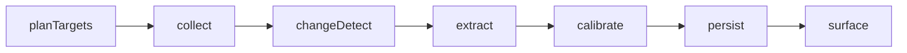
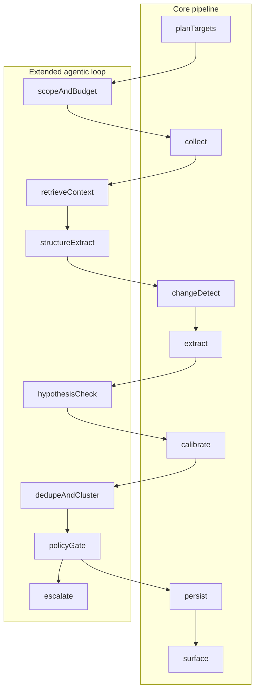

# Strategic Weak Signals — Agentic Workflows

This document specifies **agentic workflows** for the five strategic “weak signals” from the interview framework (see `README.md`). It is written for **ABB’s outside-in perspective** on competitors **Siemens, Schneider Electric, and Rockwell Automation**.

An **agentic workflow** here means: explicit roles (`Planner`, `Collector`, `Normalizer`, `Analyst`, `Verifier`, `Steward`), tools (HTTP, parsers, hashes/diffs, retrieval, LLM structured extraction), and handoffs—not only a single LLM call.

The **current Python prototype** implements a **linear pipeline** (collect → diff → extract → calibrate → persist → dashboard). A full **autonomous tool-calling agent** (dynamic replanning, multi-hop browsing) is a **future** capability aligned with the V3 roadmap.

---

## Shared orchestration pattern

All five signals can share the same high-level loop. Source-specific steps differ mainly in **how** `Collector` and `Normalizer` obtain stable text, and which **prompts** `Analyst` uses.

| Phase | Role | Typical tools | Notes |
|-------|------|---------------|--------|
| `planTargets` | **Planner** | Config/registry, URL lists, schedules | Reads competitor × signal registry (e.g. `config.yaml`). May rank URLs by freshness or strategic priority. |
| `collect` | **Collector** | HTTP client, API clients, RSS, optional browser automation | Respect robots, rate limits, terms. Returns raw bytes or structured API payloads. |
| `changeDetect` | **Normalizer** + **Steward** | Hash (e.g. SHA-256), text diff, snapshot store | Skip unchanged content to save LLM cost; attach diff summary as context for extraction. |
| `extract` | **Analyst** | Signal-specific prompt + LLM + JSON schema | Multi-event output per page or document batch. |
| `calibrate` | **Verifier** | Second-pass LLM or rule checks | Adjust confidence; flag contradictions. |
| `persist` | **Steward** | SQLite / DB, dead-letter queue | `CompetitorEvent` rows, snapshots, failures. |
| `surface` | **Steward** | Streamlit, alerts (future) | Dashboard, optional Slack/Teams later. |

### Extended agentic stack (optional / future)

These phases are **not** implemented in the current linear prototype. They describe how to evolve toward a fuller **agentic** system (tool use, replanning, quality gates).

| Phase | Role | Purpose |
|-------|------|---------|
| `scopeAndBudget` | Planner | Token/crawl budget, robots/terms check, priority queue |
| `retrieveContext` | Collector | Fetch 0–N corroborating pages (sitemap, linked release notes) — future tool use |
| `structureExtract` | Normalizer | Tables to JSON, OpenAPI parse, PDF text, repo metadata API |
| `dedupeAndCluster` | Steward | Merge near-duplicate events; cluster by entity (protocol, patent id, address) |
| `hypothesisCheck` | Verifier | Claim vs evidence pass; flag needs corroboration in narrative (e.g. in `description` until a field exists) |
| `policyGate` | Steward | PII/legal sensitivity; downgrade or drop |
| `escalate` | Steward | Human review queue when confidence is high but evidence is thin |

**Quality metrics (suggested):** precision/recall on a labeled URL set per signal; time-to-detect vs manual analyst; share of events downgraded by calibration; volume sent to `escalate`.

**Today’s code:** `main.py` runs `collect` → `changeDetect` → `extract` → `persist` in sequence; `extractor.py` performs extraction + calibration; `db.py` persists; `app.py` surfaces. There is no separate Planner process beyond static config expansion in `config_loader.get_all_target_urls`.

---

## Alignment with current prototype

| Component | File(s) | Role in workflows |
|-----------|---------|-------------------|
| Target list | `config.yaml`, `config_loader.py` | Planner input: competitors, URL categories (`developer_api`, `github`, `corporate`, etc.) |
| Fetch + text | `collector.py` | Collector |
| Change detection | `differ.py`, `db.py` snapshots | changeDetect |
| LLM extraction + calibration | `extractor.py`, `prompts/*.txt` | extract + calibrate |
| Storage | `db.py` | persist |
| UI | `app.py` | surface |
| Event shape | `schema.py` (`CompetitorEvent`) | Output contract for all signals |

Use **`signal_type`** on `CompetitorEvent` to tag the workflow (e.g. `github`, `developer_api`, `patent_outer_citation`, `academic_sponsorship`, `hyperlocal_zoning`). Use **`event_type`** for the specific phenomenon (e.g. `PROTOCOL_DRIVER_SPIKE`, `PHD_FELLOWSHIP_CLUSTER`).

---

## Signal 1 — Niche Driver & Protocol Update Spikes

**Time horizon:** 6–12 months ahead  
**Primary data sources (framework):** GitHub repos, industrial protocol forums

### Summary

Detect **early shifts in low-level software** (drivers, stacks, protocol adapters, embedded SDKs) before they show up in polished product marketing. Spikes in commits, releases, or forum threads around specific protocols (e.g. industrial fieldbuses, OPC UA variants, TSN) can presage **platform bets** and **ecosystem moves** by competitors.

### Primary data sources

- **GitHub (org + key repos):** release tags, commit velocity, dependency bumps, issue labels mentioning protocols.
- **Industrial / vendor forums:** public threads (where ToS allows) on protocol adoption, beta stacks, migration pain.
- **Package registries (optional):** PyPI/NuGet/npm where competitor SDKs are published.
- **Mailing lists / public standards discussions:** where implementers debate upcoming changes.

### Agentic workflow

1. **Planner** — Maintain a registry: competitor → GitHub orgs/repos → forum URLs/RSS → crawl depth and frequency.
2. **Collector** — Fetch repo metadata (releases, tags), recent commits (API preferred), forum pages/RSS; store raw artifacts with timestamps.
3. **Normalizer** — Normalize to text or structured JSON (e.g. release notes, diff stats); compute content hashes per logical source (repo+branch window, thread URL).
4. **changeDetect** — Compare to prior snapshot; if changed, build a **diff summary** (file/line or semantic summary) for the analyst.
5. **Analyst** — Run signal-specific extraction: identify **protocol entities**, **magnitude of change** (e.g. new adapter, breaking API), and **competitive interpretation** for ABB.
6. **Verifier** — Second pass: downgrade confidence if evidence is vague (“mentions OPC” vs “ships new OPC UA FX stack”); check consistency with known product lines.
7. **Steward** — Persist `CompetitorEvent`(s), snapshot, failures; optional dedupe by `(competitor, protocol, repo, release)`.

### Outputs (`CompetitorEvent`)

| Field | Guidance |
|-------|----------|
| `competitor` | Resolved from registry |
| `signal_type` | e.g. `github` or `protocol_stack` |
| `event_type` | e.g. `DRIVER_RELEASE`, `PROTOCOL_ADAPTER_ADDED`, `DEPENDENCY_SPIKE` |
| `title` | Short factual label |
| `description` | What changed, with evidence (repo, version, dates) |
| `strategic_implication` | Why it matters for ABB (ecosystem, lock-in, interoperability) |
| `source_url` | Canonical evidence URL (release page, commit range, forum thread) |
| `confidence_score` | After calibration |

### Guardrails

- Prefer **official APIs** over scraping where possible; honor **GitHub rate limits** and **robots.txt**.
- Do not ingest **private** or **authenticated-only** data without explicit policy.
- **Human-in-the-loop** if claiming a **new protocol commitment** or **product direction** from noisy forum text.

### Prototype status

- **Partial:** `github` (and related web) URLs and `prompts/github.txt` support GitHub-oriented extraction in the current pipeline.
- **Not in repo:** Dedicated forum adapters, package-registry mining, or protocol-entity ontology beyond what the LLM infers from text.

### Additional agentic steps

1. **Release-tag and changelog diff** — Compare semantic versions across runs; flag major/minor bumps on protocol-related repos.
2. **Dependency manifest watch** — Parse `package.json`, `.csproj`, `go.mod`, etc., when HTML exposes them or via API; detect new industrial SDK dependencies.
3. **Forum thread segmentation** — Split long threads into posts; run change detection per thread segment to reduce noise.
4. **Contributor graph snapshot** — Store unique active contributors per window; spike detection feeds `hypothesisCheck`.
5. **Package registry polling** — Scheduled queries for competitor-scoped packages (namespaces) with version history.

### How to improve this workflow

- Add **GitHub API** collectors (releases, commits, dependency graphs) instead of HTML-only org pages.
- Build a small **protocol entity lexicon** (OPC UA, MQTT, Profinet, TSN, …) for deterministic tagging before LLM extraction.
- Label a **gold set** of repo URLs and score precision/recall on “real protocol shift” vs noise.
- Automate **dedupeAndCluster** on `(repo, tag, protocol_keyword)` before persistence.

### Prompt / model levers

- Require **repo name, release tag, or file path** in `description` when claiming a technical change.
- Prefer **empty array** when the page is only navigation or repo listings with no substantive change text.
- Use **diff_context** heavily: events that imply “new” or “changed” must align with diff evidence when a diff was provided upstream.

---

## Signal 2 — Academic Sponsorship Trajectory

**Time horizon:** 5–10 years ahead  
**Primary data sources (framework):** University “Future Lab” funding, PhD fellowships

### Summary

Track **long-horizon R&D positioning** via sponsored labs, endowed chairs, joint institutes, and **PhD/fellowship clusters** in areas like robotics, AI for automation, power electronics, or edge AI. Trajectory changes often precede **hiring pipelines** and **IP themes** years later.

### Primary data sources

- **University news / press releases** (partner announcements, grants).
- **Corporate “research” or “innovation” pages** listing university partnerships.
- **EU/national grant portals** (public summaries) where competitor names appear.
- **LinkedIn / careers** (optional, policy-dependent): surge in “university liaison” roles.
- **Curated RSS / alerts** for named labs or professors.

### Agentic workflow

1. **Planner** — Define watchlist: universities, lab names, keywords (`industrial AI`, `OPC UA`, `digital twin`), competitors.
2. **Collector** — Scheduled fetch of news RSS/HTML; optional structured grant API queries by organization name.
3. **Normalizer** — Extract article body, dates, amounts (if stated), partner entities; dedupe by announcement fingerprint.
4. **changeDetect** — New announcement or **material change** (additional funding year, new lab) vs cosmetic page edits.
5. **Analyst** — Extract structured events: funding type, topic, geography, duration, named lab/PI if present; infer **strategic theme** for ABB.
6. **Verifier** — Require **primary source URL** for high confidence; penalize if only secondary blog summary.
7. **Steward** — Store events; optionally roll up into `StrategicTheme`-style grouping (future product feature).

### Outputs (`CompetitorEvent`)

| Field | Guidance |
|-------|----------|
| `signal_type` | e.g. `academic_sponsorship` |
| `event_type` | e.g. `LAB_PARTNERSHIP`, `FELLOWSHIP_PROGRAM`, `NAMED_CHAIR`, `GRANT_CO_APPEARANCE` |
| `description` | Who, where, topic, time window, quoted facts from source |
| `strategic_implication` | Long-horizon impact (talent pipeline, IP themes, standards influence) |

### Guardrails

- **No scraping** behind paywalls or portals that prohibit it; use public pages and APIs only.
- **Financial figures:** only when explicitly stated in source; otherwise mark uncertain.
- **Human review** recommended for claims about **multi-year strategic intent**.

### Prototype status

- **Not implemented** as a dedicated workflow. Generic `corporate` / `press` URLs may surface some announcements, but there is no grant-portal integration or academic watchlist module.
- **Prompt file (forward-looking):** `prompts/academic_sponsorship.txt` for use when `config.yaml` uses `signal_type: academic_sponsorship`.

### Additional agentic steps

1. **Grant portal structured query** — Batch jobs by assignee / partner name; normalize award IDs.
2. **University news RSS hub** — Single Planner feed merging multiple institutions; dedupe by headline hash.
3. **Entity linking** — Map “Institute X” to canonical university + lab URL for stable keys.
4. **Temporal rollup** — Quarterly aggregates of partnership counts by topic for trend lines (Steward analytics).
5. **Cross-source corroboration** — `retrieveContext`: if corporate press mentions a lab, fetch university primary page.

### How to improve this workflow

- Integrate **one public grant API** (region-specific) as a proof of concept before broad coverage.
- Add **evaluation**: manually label 50 announcements; tune prompts for funding amount extraction (often absent).
- Keep **human escalation** for “strategic intent” sentences; automate only factual extraction first.

### Prompt / model levers

- Never invent **amounts or durations**; if not in text, state uncertainty in `description`.
- Suggested `event_type` values: `LAB_PARTNERSHIP`, `FELLOWSHIP_PROGRAM`, `NAMED_CHAIR`, `GRANT_CO_APPEARANCE`.
- Instruct model to return `[]` for generic “innovation partnership” blurbs with no named institution or program.

---

## Signal 3 — Patent Citations from “Outer” Industries

**Time horizon:** 2–5 years ahead  
**Primary data sources (framework):** Patent databases (cross-sector citations)

### Summary

Identify when competitor filings **cite prior art from outside** core industrial automation (e.g. semiconductors, cloud, telecom, automotive software). Unusual **citation graphs** can signal **adjacent capability** moves (silicon-aware control, AI inference at edge, security models) before marketing narratives catch up.

### Primary data sources

- **Patent office APIs / bulk data** (USPTO, EPO, WIPO) — application/publication metadata, citation lists, CPC codes.
- **Competitor name + assignee filters** — normalize entity variants (subsidiaries).
- **Optional graph analytics** — not required for v1 agentic spec; can be batch jobs feeding the Analyst.

### Agentic workflow

1. **Planner** — Assignee/inventor search profiles per competitor; CPC/keyword filters for “outer” sectors.
2. **Collector** — Pull new publications since last run; retrieve citation lists and cited patent metadata.
3. **Normalizer** — Build records: `{focal_patent, cited_patent, cited_assignee_sector, date}`.
4. **changeDetect** — New publications or **new cross-sector citation edges** vs prior graph snapshot.
5. **Analyst** — Explain **why the citation is unusual** (sector distance, technology family), hypothesize product/strategy link; output multiple events if several distinct citations.
6. **Verifier** — Cross-check assignee names and dates; reduce confidence if OCR/metadata is ambiguous.
7. **Steward** — Persist; link `source_url` to patent office **stable public URL** for the focal document.

### Outputs (`CompetitorEvent`)

| Field | Guidance |
|-------|----------|
| `signal_type` | e.g. `patent_outer_citation` |
| `event_type` | e.g. `CROSS_SECTOR_CITE`, `NEW_CPC_CLUSTER`, `CO_ASSIGNEE_EMERGENCE` |
| `source_url` | Public patent document URL |
| `description` | Focal patent id, cited patent id, sectors, dates |
| `strategic_implication` | What ABB should watch or validate (capability, supplier, SW stack) |

### Guardrails

- Respect **database terms of use** and **rate limits**; prefer official APIs.
- Avoid over-claiming: citations can be **defensive** or **routine**; Verifier should temper language.
- **Human-in-the-loop** for legal-sensitive commentary; this doc is not legal advice.

### Prototype status

- **Not implemented.** No patent API client or citation graph in the current repository.
- **Prompt file (forward-looking):** `prompts/patent_outer_citation.txt` when `signal_type: patent_outer_citation`.

### Additional agentic steps

1. **Assignee normalization** — Map subsidiary names to parent competitor; store alias table in Steward.
2. **Citation sector classifier** — Rules + model: label cited assignee industry (outer vs core automation).
3. **Edge novelty score** — First-time citation from sector S to focal assignee; feeds priority in Planner.
4. **Batch graph export** — Nightly job outputs edges for offline graph analytics (optional).
5. **Patent family expansion** — Resolve simple family IDs so one event does not duplicate per jurisdiction.

### How to improve this workflow

- Start with **one office API** (e.g. public metadata + citations only) and a narrow CPC filter.
- Build **legal review** path: all narrative claims above 0.6 confidence require citation IDs in `description`.
- Measure **false “outer”** rate: random sample review weekly.

### Prompt / model levers

- Require **focal patent id** and **cited patent id** (or application id) in `description` when present in source.
- Down-rank routine citations: instruct Verifier/calibration to penalize generic backward citations.
- Use `event_type` such as `CROSS_SECTOR_CITE`, `NEW_CPC_CLUSTER`; return `[]` if input is not patent metadata text.

---

## Signal 4 — Hyper-Local “Factory Town” Intelligence

**Time horizon:** 3–12 months ahead  
**Primary data sources (framework):** Local German newspapers, municipal zoning filings

### Summary

Use **hyper-local** public signals—zoning changes, factory expansion permits, local newspaper coverage of investments—to detect **physical capacity** and **site-level** moves (new line, expansion, logistics hub) before national press picks them up.

### Primary data sources

- **Local newspapers** with online editions (RSS where available).
- **Municipal planning portals** (B-Plan changes, building permits) — jurisdiction-specific.
- **Regional economic development press releases.**
- **Optional:** job postings tied to a specific town (cross-link with careers signal).

### Agentic workflow

1. **Planner** — Geo watchlist: competitor known sites + supplier clusters + keywords (`Erweiterung`, `Neubau`, `Logistik`, company legal names).
2. **Collector** — RSS/HTML fetch per outlet; scheduled permit portal queries (often structured HTML or PDF—may need PDF text extraction).
3. **Normalizer** — Extract article text, dates, addresses; geocode or match to known site list when possible.
4. **changeDetect** — New article/permit vs prior crawl; cluster duplicates across outlets.
5. **Analyst** — Decide if signal implies **capex**, **footprint change**, or **logistics**; tie to competitor entity with explicit evidence.
6. **Verifier** — Penalize if company name is ambiguous (common surname matches); require address or official doc reference for high confidence.
7. **Steward** — Persist; tag geography in `description` or future structured fields.

### Outputs (`CompetitorEvent`)

| Field | Guidance |
|-------|----------|
| `signal_type` | e.g. `hyperlocal_zoning` |
| `event_type` | e.g. `PERMIT_FILED`, `ZONING_CHANGE`, `LOCAL_NEWS_CAPEX` |
| `source_url` | Article or official PDF/HTML portal link |
| `description` | Location, date, what was filed/built, source quotes |
| `strategic_implication` | Capacity, supply chain, regional competition for ABB |

### Guardrails

- **GDPR / personal data:** focus on **organizations and public records**; avoid collecting personal data unnecessarily.
- **Language nuance:** German local reporting may use indirect phrasing; Verifier should avoid mistranslation-driven false positives.
- **Human-in-the-loop** for high-impact claims (plant closure, major layoffs).

### Prototype status

- **Not implemented.** The prototype does not include municipal portal connectors or a geo watchlist.
- **Prompt file (forward-looking):** `prompts/hyperlocal_zoning.txt` when `signal_type: hyperlocal_zoning`.

### Additional agentic steps

1. **Site registry match** — Geocode addresses; match to known factory polygons or corporate “locations” lists.
2. **Permit PDF OCR pipeline** — `structureExtract` for scanned documents; store text + hash.
3. **Cross-outlet clustering** — Same permit cited by Zeitung A and B → one Steward event cluster.
4. **Keyword expansion** — DE/EN legal terms (`Baugenehmigung`, `Bebauungsplan`) per Bundesland.
5. **Careers cross-link** — If careers mention city X and hyperlocal mentions expansion in X, `hypothesisCheck` boosts corroboration.

### How to improve this workflow

- Pilot **one municipality** with stable permit portal HTML; measure extraction accuracy before scaling.
- Add **human-readable map link** in `description` (no PII): city + street level only when public record.
- Track **false company match** rate (same name, different entity) in evaluation set.

### Prompt / model levers

- Require **location string** (city or address) in `description` for any footprint claim.
- Suggested `event_type`: `PERMIT_FILED`, `ZONING_CHANGE`, `LOCAL_NEWS_CAPEX`.
- Flag **needs_corroboration** in prose when source uses hedging (“plant likely”, “sources say”) — calibration should downgrade.

---

## Signal 5 — Developer API & Subdomain Evolution

**Time horizon:** 3–6 months ahead  
**Primary data sources (framework):** Developer portals, CT logs, API catalogs

### Summary

Monitor **developer-facing surfaces**: API catalog changes, new SDKs, auth flows, deprecation notices, and **infrastructure footprints** (new subdomains, certificates). These changes often precede **platform launches** and **partner integration** pushes.

### Primary data sources

- **Developer portals and API docs** (HTML/OpenAPI where published).
- **Changelog / release notes** pages.
- **Certificate Transparency logs** (new subdomains hostnames) — via approved CT APIs/feeds.
- **Public API catalogs** (aggregators) as secondary corroboration.

### Agentic workflow

1. **Planner** — Map competitor developer domains, OpenAPI URLs, and high-value paths from `config.yaml` (`developer_api` entries).
2. **Collector** — Fetch portal pages and optional OpenAPI JSON; poll CT stream filtered by domain suffix.
3. **Normalizer** — Convert HTML to clean text; parse OpenAPI for new paths/versions; normalize hostname lists from CT.
4. **changeDetect** — Hash/diff page text; diff OpenAPI spec versions; new hostnames since last run.
5. **Analyst** — Use **developer_api**-oriented prompts to extract API/SDK changes, deprecations, and strategic implications for ABB integrators.
6. **Verifier** — Calibration pass; ensure deprecations vs experiments are distinguished.
7. **Steward** — Persist events and snapshots; correlate CT hostnames with portal mentions when both exist.

### Outputs (`CompetitorEvent`)

| Field | Guidance |
|-------|----------|
| `signal_type` | e.g. `developer_api` (matches config category) |
| `event_type` | e.g. `API_VERSION_BUMP`, `NEW_ENDPOINT_FAMILY`, `SDK_RELEASE`, `DEPRECATION_NOTICE`, `NEW_SUBDOMAIN` |
| `source_url` | Portal page, spec URL, or CT log query reference (as policy allows) |
| `description` | Concrete technical change |
| `strategic_implication` | Partner/ecosystem impact for ABB |

### Guardrails

- CT and DNS data can be **noisy**; require corroboration for high-confidence “new product” claims.
- Respect **portal terms** and rate limits; cache aggressively.
- **Human-in-the-loop** for security-sensitive misinterpretations (e.g. internal staging hostnames).

### Prototype status

- **Strongest in repo:** `developer_api` URLs in `config.yaml`, `prompts/developer_api.txt`, and the standard pipeline (`collector` → `differ` → `extractor` → `db` → `app`).
- **Not in repo:** Automated OpenAPI diff tool, CT log ingestion, or subdomain correlation jobs.

### Additional agentic steps

1. **OpenAPI / AsyncAPI diff** — Structural diff of paths, operations, and version fields; feed diff summary to Analyst.
2. **CT hostname correlation** — Join new hostnames to portal or docs mentions within a time window.
3. **Auth doc watch** — Separate crawl of OAuth/scopes pages; breaking changes often precede partner programs.
4. **SDK artifact polling** — Package registry versions tied to official SDK names (when published).
5. **Sitemap-guided retrieveContext** — Discover new doc paths from `sitemap.xml` before full crawl.

### How to improve this workflow

- Ship a minimal **OpenAPI fetch + JSON diff** for one competitor as the highest-ROI code upgrade.
- Add **staging vs prod** heuristics (hostname patterns) to reduce false “new product” events.
- Benchmark **noise rate** on CT-only signals separately from portal HTML.

### Prompt / model levers

- Tie **Developer API** claims to **paths, version strings, or SDK names** in `description` when present in content.
- Separate **deprecation** vs **beta/experimental** in `event_type` and confidence.
- Return `[]` for purely navigational developer homepages with no substantive API/SDK text.

---

## Revision history

| Version | Notes |
|---------|--------|
| 1.0 | Initial workflow spec alongside V2 prototype |
| 1.1 | Extended agentic stack, per-signal improvements, prompt levers; forward-looking prompt files for signals 2–4 |
